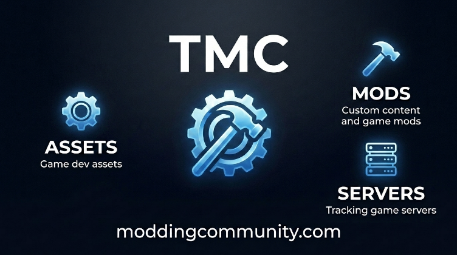

  

An inclusive **modding** and **game development** community. We offer a space where users can share game dev assets, mods, and track game/social servers. We are also creating our own gaming platform!

- 🎮 [Apps & Games](https://moddingcommunity.com/apps)
- 🔨 [Mod Workshop](https://moddingcommunity.com/mods)
  - **We're working on an [open source app](https://github.com/modcommunity/tmc-app) that will support managing mods including one-click installs!**
- ⚙️ [Assets](https://moddingcommunity.com/assets) (game assets & more!)
  - **We're creating our own cross-platform [gaming platform](https://moddingcommunity.com/play) using [@godotengine](https://github.com/godotengine)! Check out our `dot-*` assets!**
- 🌐 [Server Browser](https://moddingcommunity.com/servers)
- 📝 [Blog](https://moddingcommunity.com/blog)
- 💻 [GitHub Org](https://github.com/modcommunity)

We support popular games like [Minecraft](https://www.minecraft.net/en-us), [GTA V](https://www.rockstargames.com/gta-v), [Skyrim](https://store.steampowered.com/app/489830/The_Elder_Scrolls_V_Skyrim_Special_Edition/), [Garry's Mod](https://store.steampowered.com/app/4000/Garrys_Mod/), and many others!

## Games Using [Dot](https://moddingcommunity.com/co/4-dot-assets)
Here are a few games being made by [gamemann](https://github.com/gamemann) to demonstrate what's possible on our gaming platform.

* [**G2gfast**](https://github.com/gamemann/game-g2gfast): A 3D-based game where players *surf* and *bunny hop* on *maps* to compete for world records. This is inspired off of Source Engine movements and Counter-Strike Surfing and Bunny Hopping.
* [**Playground**](https://github.com/gamemann/game-playground): A 3D-based game that acts as a sandbox. Players can join, spawn props, throw them around, and more. This game is inspired off of Garry's Mod.
* [**Arena**](https://github.com/gamemann/game-arena): A 3D-based game where players rack up the most points to win individually or for their team in game modes such as deathmatch, gungame, and more.
* [**Hungario**](https://github.com/gamemann/game-hungario): A 2D-based game where players start off as small monsters and must eat food and others. The largest monster wins. Inspired off of the game Agario.
* [**Buses From Hell**](https://github.com/gamemann/mg-buses-from-hell): A 3D-based game where there are one or two bus driver(s) and the rest of the players must survive. The bus driver's goal is to eliminate all players. Inspired off of a classic Counter-Strike: Source MiniGames map, [buses_from_hell](https://gamebanana.com/mods/127607).
* [**Smash Copter**](https://github.com/gamemann/mg-smash-copter): A 3D based game where all players spawn on-top of platforms being held up by a single pillar. There is a canon in the middle that launches props in the air and if they fall onto the platforms, they can make it collapse killing any player standing on top of the platform. If more than one survivor/team is alive by the time runs out, all players are teleported with weapons for final death.

These games **are nowhere close to ready yet**, but there are test servers you can join straight through the website [here](https://moddingcommunity.com/play)! The goal is to show how servers host content from the global CDN and then players who connect download the game/custom content.

## Follow Us!
* Steam - [@moddingcommunity](https://steamcommunity.com/groups/moddingcommunity)
* X (Twitter) - [@modcommunity_](https://twitter.com/modcommunity_)
* YouTube - [@modcomm](https://youtube.com/@modcomm)
* Instagram - [@modcommunity_](https://instagram.com/modcommunity_)
* FaceBook - [@modcommunity](https://facebook.com/tmcmods)
